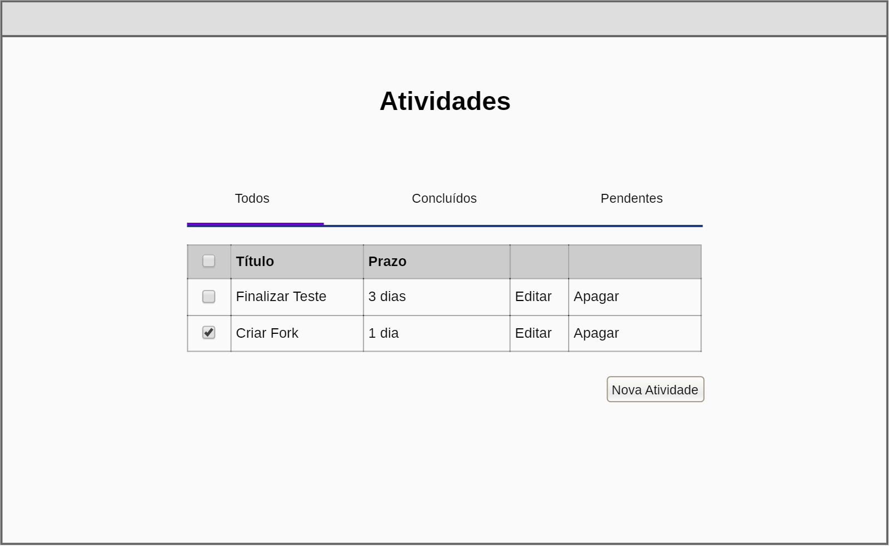
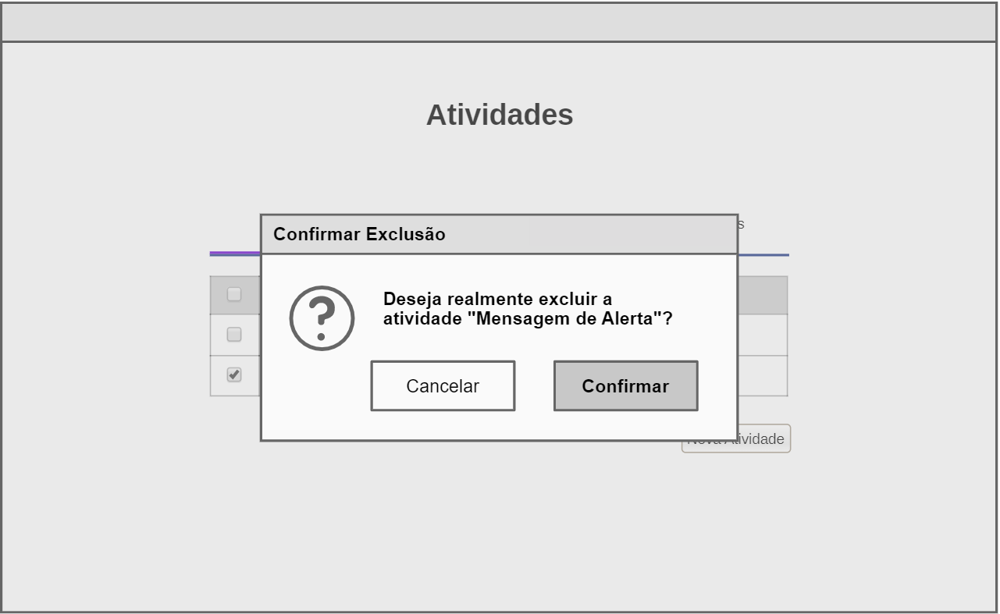
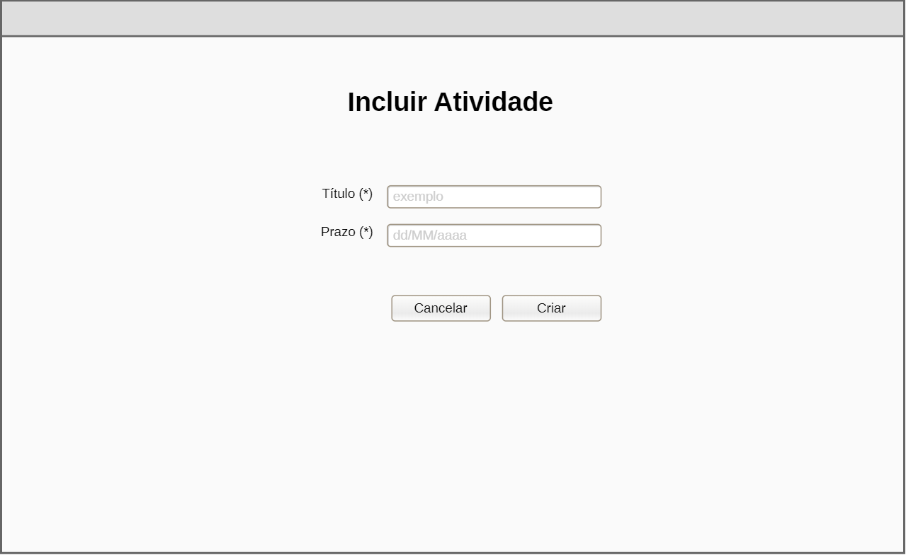
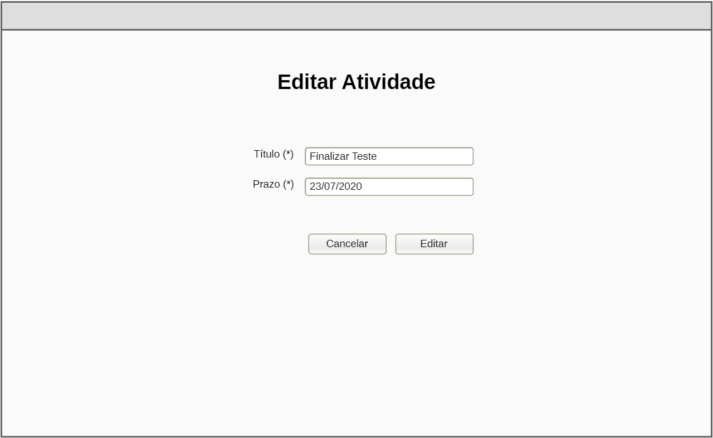

# Desafio Frontend BRQ

Obrigado pelo interesse em participar de nossa equipe!
Nesse documento você encontrará instruções para realizar o teste técnico para atuação como desenvolvedor frontend. Boa sorte!

## Método de avaliação

Serão considerados na sua avaliação os seguintes fatores:
- Organização do código
- Legibilidade
- Performance

não é necessário implementar testes para a sua aplicação.

## Objetivo
criar um registro de atividades com prazo.

## Telas

### Listagem
A primeira tela deve listar as atividades já cadastradas e seus prazos seguindo o seguinte layout:

Nessa tela deve ser possivel escolher o filtro para a lista de atividades, marcar uma atividade como concluída, acessar a página de edição e remover o item.

Para a ação de remover deve ser exibido um aviso confirmando a ação do usuário:

obs: o prazo deve ser exibido em formato 'amigável', como na imagem.

### Formulário

A segunda tela deve exibir o formulário de atividade com os campos para título (texto) e prazo (data):

Nessa tela o usuário deve preencher os campos e salvar caso todas as informações sejam válidas.

Para a edição, o formulário deve ser preenchido com as informações atuais da atividade:

## API

os métodos de comunicação com a api estarão disponíveis nos seguintes endpoints:
### Listar atividades
GET https://brq-teste.herokuapp.com/api/atividades

### Criar atividade
POST https://brq-teste.herokuapp.com/api/atividades/:ID

> {title: string, deadline: DateISOString, status: boolean}
### Editar atividade
PUT https://brq-teste.herokuapp.com/api/atividades/:ID

> {title: string, deadline: DateISOString, status: boolean}

### Remover atividade
DELETE https://brq-teste.herokuapp.com/api/atividades/:ID
